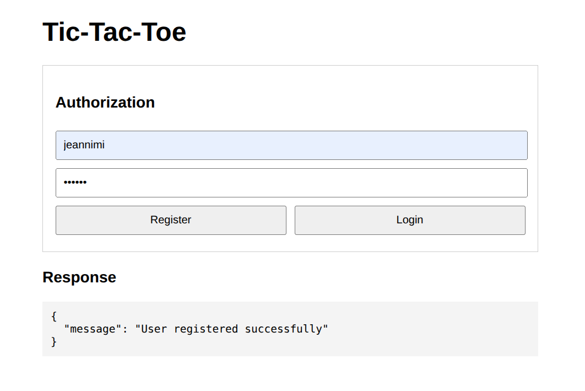
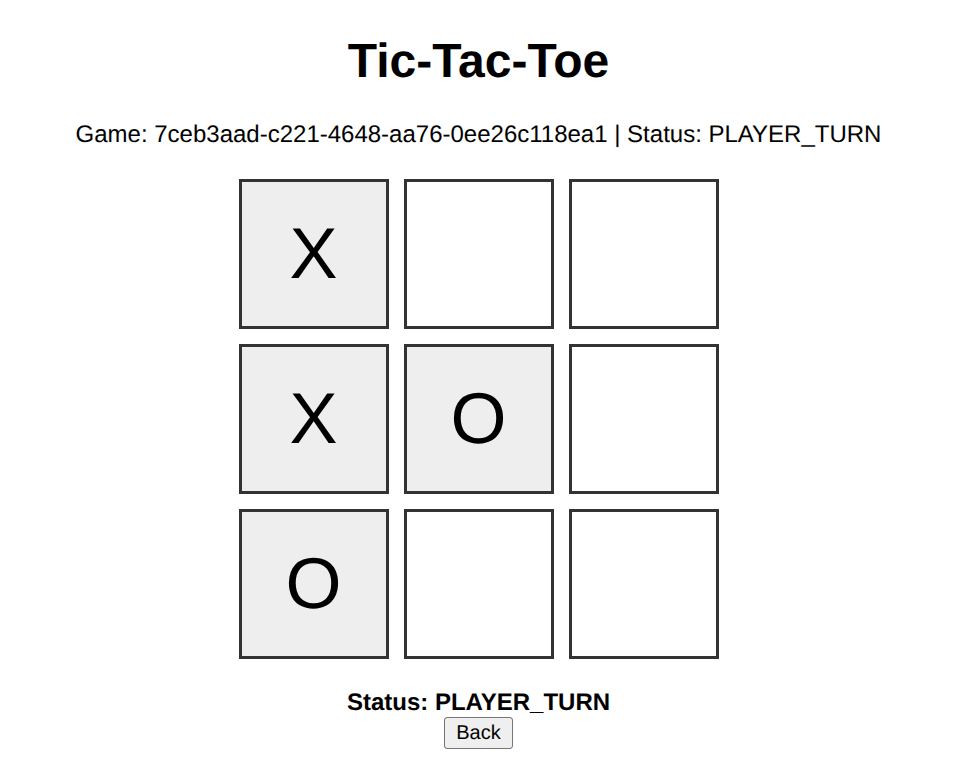

# AP1_Jv_T05B — Tic‑Tac‑Toe Web Application


## Описание

**AP1_Jv_T05B** — учебное веб‑приложение на Java (Spring Boot), реализующее игру «Крестики‑нолики» (Tic‑Tac‑Toe).

Проект создан для практики:
- разработки серверной логики;
- JWT‑авторизации;
- работы с контроллерами;
- тестирования;
- построения игровой механики через HTTP‑интерфейс.

Приложение позволяет:
- авторизоваться пользователям;
- выбирать режим игры (PVE или PVP);
- совершать ходы;
- отслеживать состояние партии;
- получать статистику побед/поражений;
- просматривать таблицу лидеров.

## Возможности

- Игровое поле $3 \times 3$
- **PVE‑режим** — игра против AI
- **PVP‑режим** — игра между двумя игроками
- **JWT‑авторизация**: регистрация, вход, обновление токена
- Ведение **статистики игрока**: победы, поражения, ничьи
- **Таблица лидеров** на основе результатов всех игроков
- Проверка ходов и строгая игровая логика
- Чёткое разделение архитектуры на контроллеры, сервисы, модели
- Интеграционные тесты (MockMvc)
- Удобная **Gradle Kotlin DSL** конфигурация

## Используемые технологии

- Java 18
- Spring Boot
- Spring Web / MVC
- Spring Security + JWT
- Gradle (Kotlin DSL)
- JUnit 5
- MockMvc
- **Frontend:** HTML, CSS, JavaScript


## Запуск

1. **Клонирование**
   ```bash
   git clone https://github.com/IAmAnAlligator/AP1_Jv_T05B.git
   cd AP1_Jv_T05B
   ```
2. **Настройка окружения**
   - Если используется Docker для базы данных:
   ```bash 
   docker-compose up -d
   ```
   - Настройте .env для секретов (JWT, DB), если нужно.

3. **Запуск приложения**
   ```bash
   ./gradlew bootRun
   ```

5. **Доступ к приложению**
   ```bash
   http://localhost:8080/
    ```

6. **Тесты**
   ```bash
   ./gradlew test
   ```

## Фронтенд
- Базовый UI на HTML/CSS/JS встроен в Spring Boot через src/main/resources/static.
- Возможна интеграция с React/Vue для более сложного интерфейса.
- Страницы включают: экран авторизации/регистрации, экран инициализации игры, игровое поле.

## Скриншоты






## Возможные улучшения

- Расширение UI с помощью React или Vue.

- Swagger/OpenAPI документация.
  
- CI/CD (GitHub Actions).
